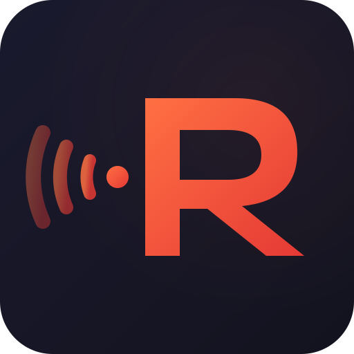
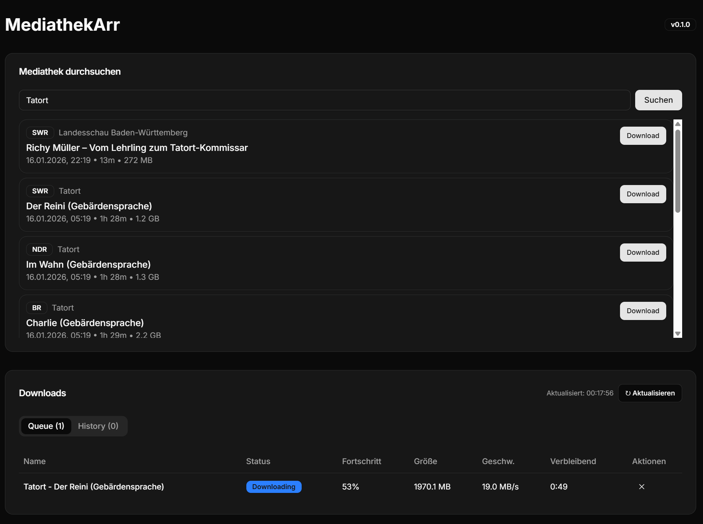

<p align="center">
  
</p>

# RundfunkArr

[](https://github.com/rundfunkarr/rundfunkarr/releases)
[](LICENSE)
[](https://github.com/rundfunkarr/rundfunkarr)
[](https://github.com/rundfunkarr/rundfunkarr/issues)

Rundfunk-Indexer für Sonarr/Radarr - Automatischer Download von ARD, ZDF und anderen deutschen Mediatheken.

## Screenshots

<p align="center">
  
</p>

## Features

- **Newznab-kompatibler Indexer** - Funktioniert mit Prowlarr, NZB Hydra, Sonarr und Radarr
- **SABnzbd-kompatibler Downloader** - Direkter HTTP-Download von den Mediatheken
- **Automatische MKV-Konvertierung** - FFmpeg-Integration mit deutschen Sprachmetadaten
- **Flexible Metadaten-Quellen** - Lokale Datenbank, TVDB oder TMDB
- **Community-Rulesets** - Lokale Rulesets via Pull Request erweiterbar
- **SQLite-Datenbank** - Persistente Speicherung von Cache und Download-Historie

## Installation mit Docker

### docker-compose.yml

```yaml
services:
  rundfunkarr:
    image: rundfunkarr/rundfunkarr:latest
    container_name: rundfunkarr
    environment:
      - TZ=Europe/Berlin
      - PUID=1000                           # User ID (id -u)
      - PGID=1000                           # Group ID (id -g)
      - DOWNLOAD_FOLDER_PATH=/downloads
    volumes:
      - ./data:/app/prisma/data
      - ./downloads:/app/downloads
    ports:
      - "127.0.0.1:6767:6767"
    restart: unless-stopped
```

Nach dem Start ist die Web-Oberfläche unter `http://localhost:6767` erreichbar. Beim ersten Start führt der **Setup-Wizard** durch die Konfiguration (API Keys, Pfade, etc.).

### Starten

```bash
docker-compose up -d
```

## Manuelle Installation

### Voraussetzungen

- Node.js >= 20
- npm
- FFmpeg (für MKV-Konvertierung)

### Setup

```bash
# Dependencies installieren
npm install

# Datenbank initialisieren
npx prisma migrate dev

# Development Server starten
npm run dev

# Oder Production Build
npm run build
npm start
```

## Konfiguration

### Umgebungsvariablen

| Variable | Beschreibung | Standard |
|----------|--------------|----------|
| `PUID` | User ID für Dateiberechtigungen | `1001` |
| `PGID` | Group ID für Dateiberechtigungen | `1001` |
| `DOWNLOAD_FOLDER_PATH` | Pfad für fertige Downloads im Container | `/downloads` |
| `DOWNLOAD_TEMP_PATH` | Pfad für laufende Downloads (incomplete) | `$DOWNLOAD_FOLDER_PATH/incomplete` |
| `DATABASE_URL` | SQLite Datenbank-Pfad | `file:./prisma/data/rundfunkarr.db` |

### Web-Oberfläche

RundfunkArr bietet eine vollständige Web-Oberfläche mit:

- **Dashboard** - Übersicht über aktive Downloads und letzte Aktivitäten
- **Suche** - Direkte Suche in den Mediatheken
- **Downloads** - Queue und Historie verwalten
- **Settings** - Alle Einstellungen konfigurieren:
  - Download-Pfad und Qualitäts-Präferenzen
  - API Keys für TVDB/TMDB
  - Matching-Strategie und Schwellwerte
  - Cache-TTL Einstellungen
- **Setup-Wizard** - Geführte Erstkonfiguration

### Metadaten-Quellen

RundfunkArr sucht Show-Informationen in folgender Reihenfolge:

1. **Lokale Datenbank** (`data/shows.json`) - Kein API Key nötig
2. **TVDB** - Wenn in den Einstellungen konfiguriert (kostenpflichtig)
3. **TMDB** - Wenn in den Einstellungen konfiguriert (kostenlos)

Für Shows die nicht in TVDB/TMDB sind, können Einträge in `data/shows.json` hinzugefügt werden.

## API Endpoints

### Indexer (Newznab)

| Endpoint | Beschreibung |
|----------|--------------|
| `GET /api/newznab?t=caps` | Capabilities XML |
| `GET /api/newznab?t=tvsearch&tvdbid=123` | TV-Suche nach TVDB ID |
| `GET /api/newznab?t=tvsearch&q=Tatort` | TV-Suche nach Name |
| `GET /api/newznab?t=search` | RSS Feed |

### Downloader (SABnzbd-kompatibel)

| Endpoint | Beschreibung |
|----------|--------------|
| `GET /api?mode=version` | Version |
| `GET /api?mode=get_config` | Konfiguration |
| `GET /api?mode=queue` | Download-Queue |
| `GET /api?mode=history` | Download-Historie |
| `POST /api?mode=addfile&cat=sonarr` | Download hinzufügen |

## Sonarr/Radarr Einrichtung

### Als Indexer (in Prowlarr oder direkt)

1. Indexer hinzufügen → Generic Newznab
2. URL: `http://rundfunkarr:6767/api/newznab`
3. API Key: beliebig (wird nicht validiert)

### Als Download Client

1. Download Client hinzufügen → SABnzbd
2. Host: `rundfunkarr`
3. Port: `6767`
4. API Key: beliebig

## Rulesets & Shows hinzufügen

### Neue Show hinzufügen

1. Show in `data/shows.json` hinzufügen:
```json
{
  "tvdbId": 123456,
  "name": "Show Name",
  "germanName": "Deutscher Name",
  "aliases": [],
  "episodes": [
    { "name": "Episode 1", "seasonNumber": 1, "episodeNumber": 1, "aired": "2024-01-01" }
  ]
}
```

2. Ruleset in `data/rulesets.json` hinzufügen:
```json
{
  "id": 1001,
  "mediaId": 1001,
  "topic": "Mediathek Topic Name",
  "priority": 0,
  "filters": "[{\"attribute\":\"duration\",\"type\":\"GreaterThan\",\"value\":\"30\"}]",
  "titleRegexRules": "[]",
  "episodeRegex": "(?<=E)(\\d{2})(?=\\))",
  "seasonRegex": "(?<=S)(\\d{2})(?=/E)",
  "matchingStrategy": "SeasonAndEpisodeNumber",
  "media": {
    "media_id": 1001,
    "media_name": "Show Name",
    "media_type": "show",
    "media_tvdbId": 123456,
    "media_tmdbId": null,
    "media_imdbId": null
  }
}
```

3. Pull Request erstellen

## Entwicklung

```bash
# Development mit Hot Reload
npm run dev

# TypeScript Check
npx tsc --noEmit

# Lint
npm run lint

# Datenbank-Migration erstellen
npm run db:migrate
```

## Projektstruktur

```
src/
├── app/               # Next.js App Router
│   ├── api/           # API Routes
│   │   ├── newznab/   # Indexer API (Newznab)
│   │   ├── settings/  # Settings API
│   │   └── route.ts   # Downloader API (SABnzbd)
│   ├── settings/      # Settings Page
│   ├── setup/         # Setup Wizard
│   ├── search/        # Search Page
│   └── downloads/     # Downloads Page
├── components/        # React Components
│   └── layout/        # Sidebar, Navigation
├── contexts/          # React Context
│   └── settings-context.tsx
├── services/          # Business Logic
│   ├── mediathek.ts   # MediathekView API
│   ├── shows.ts       # Unified Show Lookup
│   ├── tvdb.ts        # TVDB API
│   ├── tmdb.ts        # TMDB API
│   ├── newznab.ts     # RSS/XML Generation
│   └── rulesets.ts    # Matching Rules
├── server/            # Server-Side Only
│   ├── download-manager.ts
│   └── ffmpeg.ts
└── lib/               # Utilities
    ├── db.ts          # Prisma Client
    ├── cache.ts       # Dynamic TTL Caches
    └── settings.ts    # Settings Helper
data/
├── shows.json         # Lokale Show-Datenbank
└── rulesets.json      # Matching Rulesets
```

## Credits

- [PCJones/MediathekArr](https://github.com/PCJones/MediathekArr) - Original .NET Implementation
- [MediathekViewWeb](https://github.com/mediathekview/mediathekviewweb) - Mediathek API
- [TheTVDB](https://thetvdb.com) - Metadaten API
- [TMDB](https://www.themoviedb.org) - Metadaten API

## Lizenz

MIT
